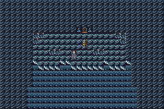
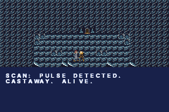
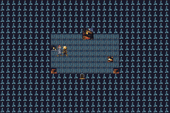
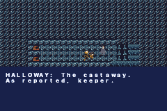

# TIDELIGHT — the GBA demake

The [demos/tidelight](../../demos/tidelight) story — an obsolete lighthouse
automaton, three nights before decommission, finds a half-drowned deserter on
the rocks, and protocol says report her — demade into a real Game Boy Advance
cartridge through the `@pocketjs/aot` pipeline. TSX in, `.gba` out; no JS
engine on the cartridge.

|  |  |
|---|---|
|  |  |

*Night one on the shore; the SCAN beat; the night-two fireside (stove, wire,
cot — every prop is an actor); Inspector Halloway delivering a verdict on the
pier.*

## Play it

```bash
# prerequisites: bun, arm-none-eabi-gcc (brew install arm-none-eabi-gcc),
# mGBA (brew install mgba)
bash aot/play.sh aot/tidelight/game.tsx   # build + open in the mGBA window
```

mGBA default keys: arrows walk, X = A (talk / advance / choose), Enter = Start.
The ROM lands at `aot/dist/tidelight.gba` if you'd rather load it yourself.

## What survived the demake

The framework original leans on the virtual clock (timed choices, QTE
windows); the AOT script VM keeps no clock, so every Detroit-derived mechanic
is re-expressed in vocabulary the cartridge has:

| framework original | GBA demake |
| --- | --- |
| timed choices | `choose()` menus — hesitation is free here |
| QTE storm set pieces | knowledge checks (vent THEN strike, or the pane cracks) |
| DIRECTIVE / TRUST meters | the flags themselves gate every late option |
| post-chapter flowchart + REPLAY | the nights are literal chapter maps, advanced by one-way warps past the cot |
| six endings | five verdicts on the pier, derived from the flags the dawn finds |

Fail-forward still holds: skipped beats are silent-keeper choices, an
untended stove is a cold one, and the dawn arithmetic reads whatever it finds.

## Content pipeline

Same contract as the framework demo: `imagegen/gen-source.ts` generates the
source art through the PixelLab API (seeded, committed, skip-if-exists);
`imagegen/build-assets.ts` deterministically quantizes it to GBA 4bpp —
8x8 terrain tiles (box-averaged with a gentle per-tile contrast expansion)
and 16x16 OBJ facings (walk frame 2 is derived: mirrored arm-swing for
up/down, a 1px leg stride for the side views). The wire and the lamp are
static prop sprites cut from their own tiles.

## Verify

```bash
cd aot
bun run test:tidelight   # headless mGBA: full playthrough, 39 assertions
```

`test/tidelight-e2e.ts` drives the obedient-machine tape (interact, top
option, everywhere) through boot -> carry -> report -> stove -> vent-strike ->
irons confirmed -> name -> coat -> the fork -> pier, and asserts flags, map
transitions, dialogue text ids, and ENDING 1 (GOOD ORDER) on real emulated
hardware — the same golden path the framework's sim test pins.
