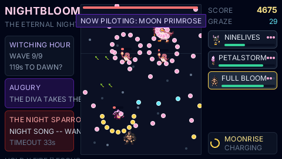

# NIGHTBLOOM — a garden against the eternal night

A vertical danmaku shooter on the PocketJS deterministic runtime, in the
grammar of Touhou's *Imperishable Night*: the player pilots one plant at the
bottom of a portrait playfield, the eternal-night youkai horde descends from
the treeline above, and the piloted form switches mid-fight — five plants,
five shot types, five spell cards, one three-card final boss. The art is the
garden-defense bestiary, PixelLab-generated and committed.

On the 480x272 landscape screen the field is the classic arcade adaptation:
a portrait column in the center, HUD panels on both sides (the night on the
left, the roster on the right).



*The witching hour. The NIGHT SPARROW DIVA opens NIGHT SONG — WANDERING
CHORUS; the catnip kit answers from below, NINE LIVES on the wing.*

## Play it

```bash
bun scripts/dev.ts nightbloom-main    # then open http://127.0.0.1:8130/?demo=nightbloom-main
```

| input | keyboard | does |
| --- | --- | --- |
| d-pad | arrows | fly (8-way) |
| CROSS (hold) | X | fire |
| SQUARE (hold) | A | focus — half speed, hitbox shown |
| CIRCLE / R | Z / E | switch to the next living form |
| L | Q | switch back |
| TRIANGLE | S | the piloted form's spell card |
| SELECT | Shift | the garden codex (forms, foes, laws) |
| START | Space | start / pause |

Survive the night: nine waves across DUSK and MIDNIGHT, a midboss, and THE
NIGHT SPARROW DIVA's three spell cards at the witching hour. When a form
wilts the next one takes the stick; lose all five and the night is eternal.

## The roster — five forms, five answers

| form | shot | the trade |
| --- | --- | --- |
| CATNIP KIT | homing orbs | never misses, hits soft; the boss-killer |
| BAMBOO ARBALEST | piercing bolts | straight lines, hits through bodies |
| SAKURA SENTINEL | petal fan | true damage — the KASA RONIN's armor means nothing |
| STONE LANTERN | slow heavy shots | armor + a huge pool; STONEHEART heals it full |
| MOON PRIMROSE | thin twin streams | motes are worth double glow to her |

Spell cards double as bullet clears: NINE LIVES (homing burst), PIERCING
GALE (a beam up the column), PETALFALL (clear every shot on the field),
STONEHEART (full heal + shield), MOONRISE (+80 glow to the whole roster).

**Two evolution laws.** Forms grow by their own work — glow comes from the
damage the piloted form deals, the motes it gathers (auto-collected above
the high line, the PoC), and the bullets it grazes — and ascend I → II → III
into wider patterns and deeper pools. Foes grow with the hour: DUSK sends
stage I, MIDNIGHT II, the WITCHING HOUR III.

## What it demonstrates, mechanically

tidelight proved the deterministic runtime on a branching story; NIGHTBLOOM
proves it on a bullet-hell:

- the battle advances in **fixed 1/60 s micro-ticks**, `ticksPerFrame()` per
  host frame, batches aligned so the tick count at any virtual second is
  identical at every `simulationHz` — **the 2 Hz world dodges the same
  spiral** (`?hz=2` on the web host to watch it);
- danmaku pattern math runs on a **quantized sine table** (1/8192 steps),
  because raw `Math.sin` is not bit-specified across JS engines and a spiral
  must replay byte-exactly on every host;
- press edges land on the first tick of a frame's batch; held verbs
  (movement, fire, focus) read the raw held mask, whose level track goes
  true at the same battle tick at every rate — hold-driven tapes subsample
  exactly;
- waves draw entry slots from one seeded xorshift32; float fx drift by
  battle-tick age; the phase augury arrives through the effect shell
  (`backend.ts`).

**Sound** is an output, never an input: the engine emits `SfxKind` events
(the hit thock, the kill pop, graze pings, spell declarations, the dawn
arpeggio) into a host sound sink. `sfx.ts` installs one where WebAudio
exists — every voice is synthesized from oscillators and a deterministic
noise buffer, no assets — and resumes on the first key press per the
browser's autoplay policy. The headless sim and the PSP never install a
sink, and the simulation is byte-identical either way.

`test/nightbloom.sim.test.ts` drives two tapes through the headless sim
host: THE MARKSMAN, a full clear (~171 s — every form flies, three reach
stage III, the diva's last card breaks with 4 of 5 forms alive), and THE
SLEEPER, an untouched loss. It asserts repeat-identity, chaos immunity,
strict 4 Hz / 2 Hz subsampling of both tapes, cross-rate byte-equal outcome
screens, augury effect timing, and the exact score / graze / kill / bloom
ledger. Wired into `bun run test`.

## Content pipeline

Same contract as the tidelight demo: every sprite and backdrop is generated
by the PixelLab pixel-art API (pixellab.ai) from the seeded manifest in
`data.ts` — `gen-assets.ts` is a no-op unless an asset is deleted or
`--force` is passed, and committed PNGs are re-encoded through the pak-safe
canonical subset.

```bash
bun demos/nightbloom/gen-assets.ts             # generate missing assets
bun demos/nightbloom/gen-assets.ts --only=p-catnip-2.png
```

Evolution stages are `init_image` chains — stage II derives from stage I,
III from II — so a creature keeps its identity as it ascends. Stats, prompts
and sprite filenames live in one table (`validateContent()` runs in the sim
test), and the bosses wear the stage-III art drawn large. Enemy danmaku is
native dots (no textures) — player shots, mochi and motes use the sprite
art. Auth: `PIXELLAB_API_KEY` in the repo root `.env` (gitignored).
